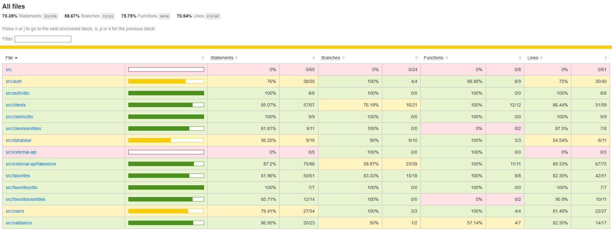
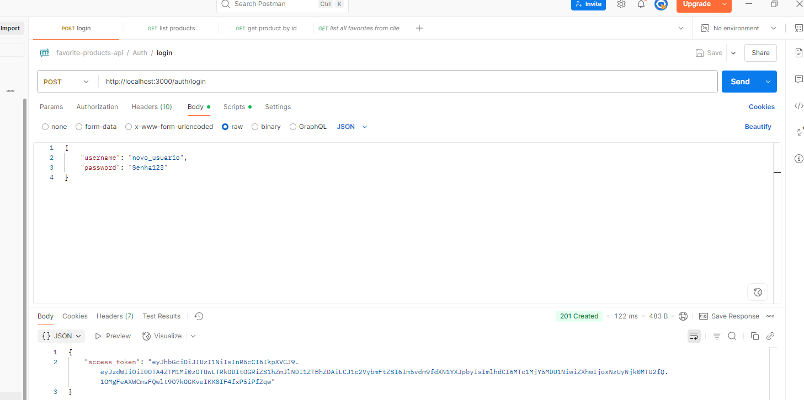
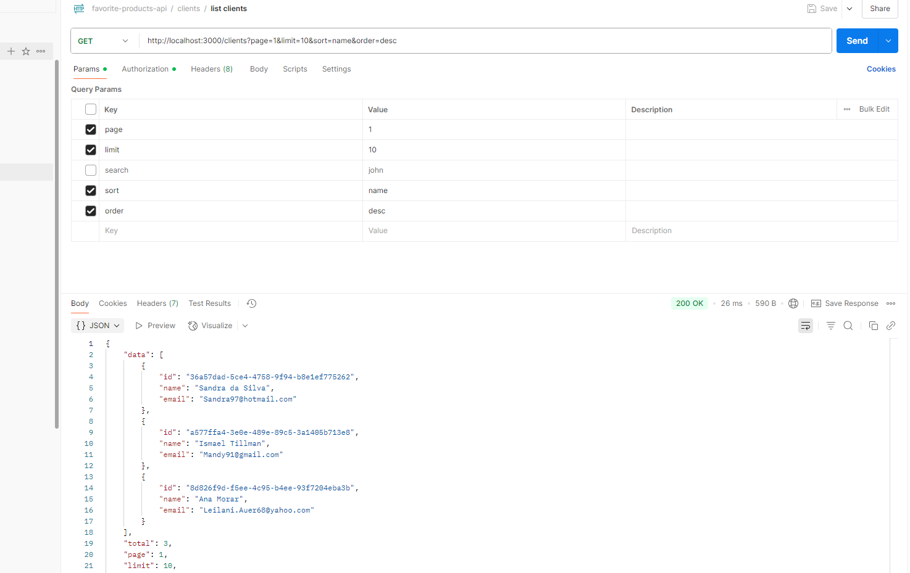
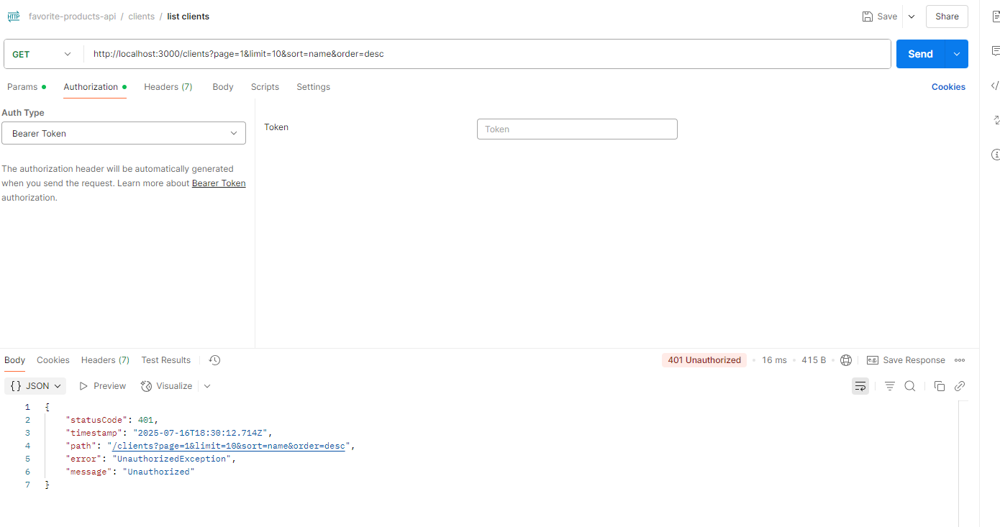

# favorite-products-api

## summary

this project is a robust restful api built with nestjs, leveraging modern best practices for security, performance, and maintainability. it integrates with postgresql using typeorm, applies strong validation and authentication mechanisms, and is designed for scalability and efficient data access. the api also demonstrates comprehensive testing and caching strategies to ensure reliability and responsiveness.

## swagger
http://localhost:3000/api

tip: [postman collection](./favorite-products-api.postman_collection.json)

## tech stack

- **nestjs** (node.js + typescript) — core api framework
- **bcryptjs** — secure password hashing
- **cache manager** — caching abstraction layer
- **class-validator** — data validation (dtos)
- **cors** — cross-origin protection
- **csrf** — csrf protection
- **docker/docker compose** (optional, for database)
- **helmet** — http header security
- **jwt** — json web token authentication
- **passport + @nestjs/passport + @nestjs/jwt** — jwt authentication
- **passport.js** — authentication middleware
- **pino** — structured logging
- **postgresql** — relational database
- **postman** (api testing suite)
- **redis** — in-memory data store for caching
- **serve static** — static file serving middleware
- **typeorm** — orm for relational database integration
- **zod** — schema validation

## techniques and patterns used

- **indexing for efficient filtering:**  
  database indexes are strategically created to optimize query performance, especially for endpoints that support filtering and searching. this ensures fast data retrieval even as the dataset grows.

- **selective data retrieval:**  
  all database queries are designed to fetch only the necessary fields, minimizing data transfer and improving response times.

- **redis caching for external api data:**  
  data fetched from the external fakestore api is cached in redis. this reduces latency, decreases the load on external services, and improves the overall user experience.

- **factory method pattern for database connections:**  
  the application uses the factory method design pattern to manage database connections. this promotes code reusability, encapsulation, and makes it easier to switch or configure different database providers.

- **unit and integration testing:**  
  the codebase includes both unit and integration tests to ensure correctness, reliability, and to catch regressions early in the development process.

```
# docker compose database commands

run database
$ docker compose up -d 

stop database
$ docker compose down 

view database logs
$ docker compose logs -f 
```

```
# to run application

node version v22.16.0

$ cp .env.example .env
$ npm i
$ npm run start:dev
```

coverage 

screen capture frontend (without jwt/auth - public/index.html): 

login: 

list user - auth sucess: 

list user - auth error: 

### how to use api - step by step 
`some endpoints - full list in the collection`

1. register a user
```
post /auth/register
content-type: application/json

{
  "username": "new_user",
  "password": "password123"
}
```

2. log in
```
post /auth/login
content-type: application/json

{
  "username": "new_user",
  "password": "password123"
}
```

3. create a client
```
post /clients
authorization: bearer <access_token>
content-type: application/json

{
  "name": "john doe",
  "email": "john@example.com"
}
```

4. browse products from fakestore
```
get /external-products?page=1&limit=10
```

5. add a product to favorites
```
post /clients/:id/favorites
authorization: bearer <access_token>
content-type: application/json

{
  "productid": 5
}
```

6. list a client's favorite products
```
get /clients/:id/favorites?page=1&limit=10&sort=price&order=asc
authorization: bearer <access_token>
```
